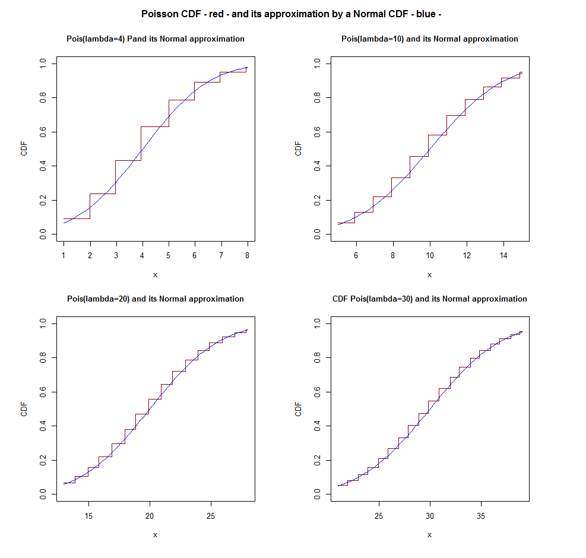
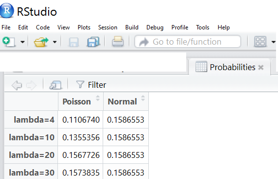
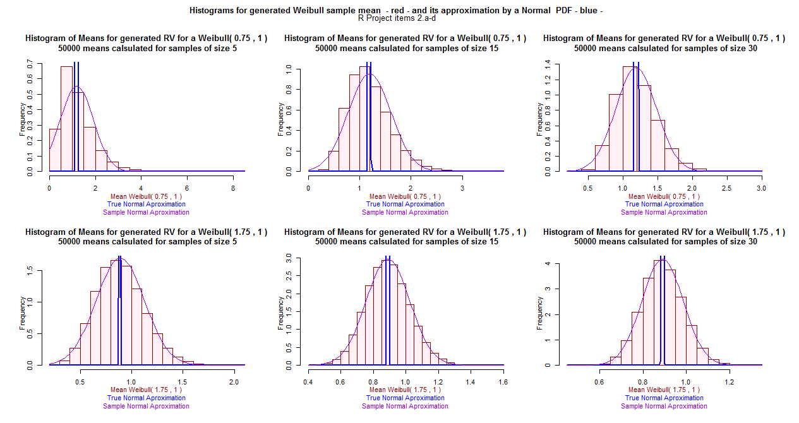
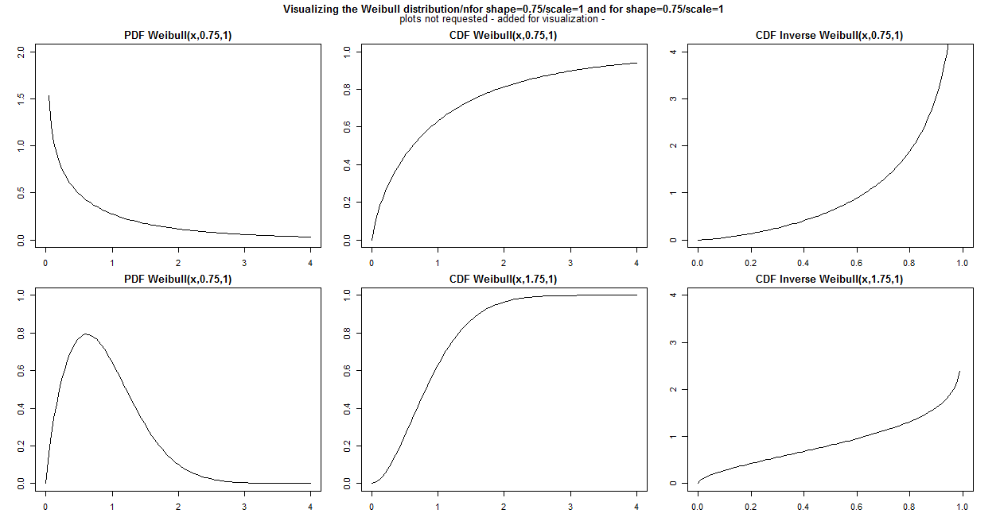
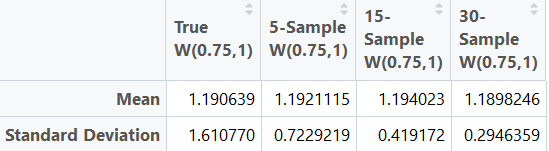
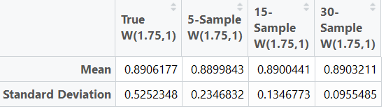

# ST-501---R-Project Group 04

## Group members:
- Zakary Brown
- Patricia Chavez
- Anna Jiang
- WANG YUXI

## Note:
- The code below is just a suggestion.  Please provide your feedback.

## Suggested Approach
- Review the code for item 1 and for item 2
- Provide your suggested code or any corrections/improvements to the posted code
- Write the analysis statements requested in (1.f), (1.g) and (2.f)
- Post your suggestions, feedbacks, analytical statements
- We need to agree on the final versions to be organized and submitted to Dr. Post.

## Item 1
The R code is located : 

The requested plots are:

An additional information for our own understanding:

## Item 2
The R code is located : 

The requested plots are:

An additional information for our own understanding:

